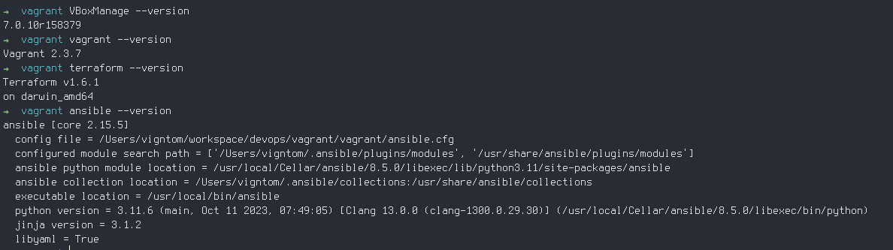
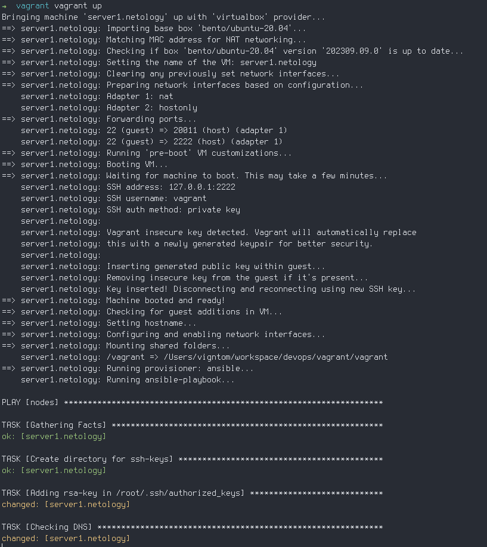
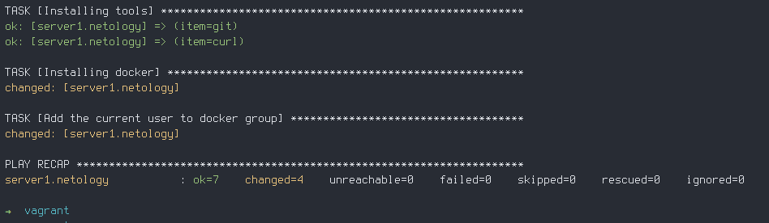
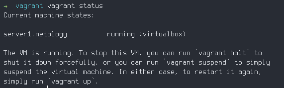
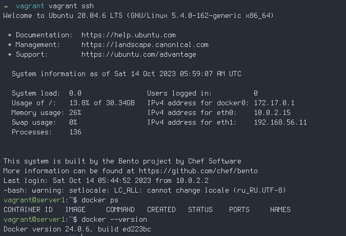

# Задача 1

  * Опишите основные преимущества применения на практике IaaC-паттернов.
  * Какой из принципов IaaC является основополагающим?

Основные преимущества:
  1. Ускорение развертывания инфраструктуры.
  2. Стабильность инфраструктуры.
  3. Быстрая и эффективная разработка.

Основополагающий принцип - это Идемпотентность. То есть при многократном применении кода получается одинаковый результат.

# Задача 2

  * Чем Ansible выгодно отличается от других систем управление конфигурациями?
  * Какой, на ваш взгляд, метод работы систем конфигурации более надёжный — push или pull?

Основные преимущества Ansible - это скоросьть, простота и расширяемость. Выходно отличается что применяется
метод работы push и относительная простота использования то есть низкий порог вхождения.

Какой метод работы систем конфигураций более надежный?

В целом для ответа не хватает знаний. Но так с моей точки зрения все зависит от требований. Как мне кажется
с увеличением количества систем надежность pull возрастает по сравнению с push методом.  

# Задача 3

  Установите на личный компьютер:

  * VirtualBox,
  * Vagrant,
  * Terraform,
  * Ansible.

  Приложите вывод команд установленных версий каждой из программ, оформленный в Markdown.

  

# Задача 4

  Воспроизведите практическую часть лекции самостоятельно.

  * Создайте виртуальную машину.
  * Зайдите внутрь ВМ, убедитесь, что Docker установлен с помощью команды

##### Создайте виртуальную машину.

  
  
  
  
##### Зайдите внутрь ВМ, убедитесь, что Docker установлен с помощью команды

  
    
