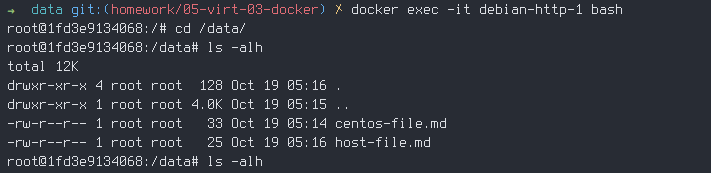

# Задача 1

Сценарий выполнения задачи:

  * создайте свой репозиторий на https://hub.docker.com;
  * выберите любой образ, который содержит веб-сервер Nginx;
  * создайте свой fork образа;
  * реализуйте функциональность: запуск веб-сервера в фоне с индекс-страницей, содержащей HTML-код ниже:

```sh 
<html>
<head>
Hey, Netology
</head>
<body>
<h1>I’m DevOps Engineer!</h1>
</body>
</html>
```

    Опубликуйте созданный fork в своём репозитории и предоставьте ответ в виде
ссылки на https://hub.docker.com/username_repo.

  Результат: https://hub.docker.com/r/vigntom/nginx-web


# Задача 2

Посмотрите на сценарий ниже и ответьте на вопрос: «Подходит ли в этом сценарии использование
Docker-контейнеров или лучше подойдёт виртуальная машина, физическая машина?
Может быть, возможны разные варианты?»

Детально опишите и обоснуйте свой выбор.

--

Сценарий:

  * высоконагруженное монолитное Java веб-приложение;
  * Nodejs веб-приложение;
  * мобильное приложение c версиями для Android и iOS;
  * шина данных на базе Apache Kafka;
  * Elasticsearch-кластер для реализации логирования продуктивного веб-приложения — три ноды elasticsearch, два logstash и две ноды kibana;
  * мониторинг-стек на базе Prometheus и Grafana;
  * MongoDB как основное хранилище данных для Java-приложения;
  * Gitlab-сервер для реализации CI/CD-процессов и приватный (закрытый) Docker Registry.

  Ответ:

  1. Монолитное приложение подразумевает что все компоненты приложения объедены в единый блоr и поэтому выполняется как
  единый сервис. Так как приложение еще и высоконагруженое то больше подходят другие решения то есть виртуальная машина
  или физическая. С другой стороны контейнеризация предлагает еще и быстрое развертывание и поэтому возможно применение
  docker-контейнера для разработки или тестирования. 
  2. Nodejs приложение отличается тем что выполняется в одном потоке. Для увеличения производительности часто приложения
  организуются в кластеры. Это можно сделать используя для запуска приложения специальные программы например pm2.
  Другим вариантом является контейнеризация и использование load balancer а. Поэтому docker контейнер подходит
  для этого случая.
  3. Мобильное приложение запускается либо на телефоне либо в симуляторе ios либо в эмуляторе android.
  Для этого требуется графическая среда и к тому же для ios приложения Mac OS. Поэтому для этого варианта либо
  виртуальная машина либо физическая машина.
  4. Шина данных на базе Apache Kafka является распределенной системой для потоковой обработки. Слово распределенная
  подрзумевает что это система работает на множестве машин и контейнеризация хорошо подходит.
  5. Elasticsearch-кластер который сосотоит из нескольких частей. В данном случае контейнеризация хорошее решение так как
  с помощью docker можно автоматизировать сборку как отдельных частей системы так и их взаимодействие.
  6. Мониторинг стек на базе Prometheus и Grafana. В данном случае имеется опять система которая распределена на
  несколько частей и подходит для контейнеризации.
  7. MongoDb - это распределенная БД. Как видно из слова распределенная, для получения всех преимуществ системы нужно
  использовать несколько машин. В данном случае контейнеризация хорошее решение.
  8. В данном случае система состоит из несколькихчастей которые взаимодействуют между собой. Думаю что контенйнеризация
  подходит как раз для таких случаев.


# Задача 3

  * Запустите первый контейнер из образа centos c любым тегом в фоновом режиме,
  подключив папку /data из текущей рабочей директории на хостовой машине в /data контейнера.
  * Запустите второй контейнер из образа debian в фоновом режиме,
  подключив папку /data из текущей рабочей директории на хостовой машине в /data контейнера.
  * Подключитесь к первому контейнеру с помощью docker exec и создайте текстовый
  файл любого содержания в /data.
  * Добавьте ещё один файл в папку /data на хостовой машине.
  * Подключитесь во второй контейнер и отобразите листинг и содержание файлов в /data контейнера.

  Ответ:
  * Взял этот образ `docker pull centos/httpd` и запустил командой:\
`docker run -d -p 3080:80 -v "$(pwd)"/data:/data --name centos-httpd-1 centos/httpd`
  * Взял образ `docker pull debian` и написал Dockerfile docker/debian/Dockerfile
```
FROM debian
RUN apt update && apt install -y python3
CMD [ "python3", "-m", "http.server", "9000" ]
```
И запустил командой
```
docker build -t debian-python-1.
docker run -d -p 9000:9000 -v "$(pwd)"/data:/data --name debian-http-1 debian-python-1
```

И провел манипуляции с файлами в контейнерах =)

  
