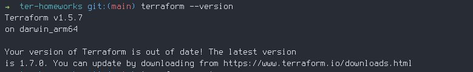

# Домашнее задание к занятию «Введение в Terraform»

# Чек-лист

  Задача: Приложите скриншот вывода команды terraform --version

  

# Задание 1

  1. Перейдите в каталог src. Скачайте все необходимые зависимости, использованные в проекте. 

  Запустил `terraform init`

  2. Изучите файл .gitignore. В каком terraform-файле, согласно этому .gitignore, допустимо сохранить личную, секретную информацию?
  
  В файле personal.auto.tfvars

  3. Выполните код проекта. Найдите в state-файле секретное содержимое созданного ресурса random_password, пришлите в качестве ответа конкретный ключ и его значение.

  "result": "D1R5rAzVlF5Hd7r4"

  4. Раскомментируйте блок кода, примерно расположенный на строчках 29–42 файла main.tf. Выполните команду terraform validate. Объясните, в чём заключаются намеренно допущенные ошибки. Исправьте их.

  - Ошибка возникла из за отсутствия имени (2 label) при объявлении ресурса
  - В данном случае ошибка что первый символ имени ресурса - цифра.

  После исправления этих ошибок и повторной валидации появились еще ошибки

  - Ошибка в обращении к параметру ресурса. Тут я указал имя ресурса docker_image как image и поэтому ошибка. Но можно было указать имя как nginx и избежать этой ошибки.
  - Тут 2 ошибки в параметере random_password.random_string_FAKE.resulT. Указано неверное имя и опечатка =) в параметере.

  5. Выполните код. В качестве ответа приложите: исправленный фрагмент кода и вывод команды docker ps.

  6. Замените имя docker-контейнера в блоке кода на hello_world. Не перепутайте имя контейнера и имя образа. Мы всё ещё продолжаем использовать name = "nginx:latest". Выполните команду terraform apply -auto-approve. Объясните своими словами, в чём может быть опасность применения ключа -auto-approve. Догадайтесь или нагуглите зачем может пригодиться данный ключ? В качестве ответа дополнительно приложите вывод команды docker ps.

   
   Догадка: Ключ -auto-approve нужен для запуска без подтверждения (нужно набрать yes без него чтобы применить изменения)
Опасность что нет возможности еще раз проверить изменения и оменить команду. Нужен для автоматизации.

В документации terraform написано что может применяться для автоматизации при деплое в pre-release или разработке. При production деплое очень рекомендуется не использовать этот параметр.

  7. Уничтожьте созданные ресурсы с помощью terraform. Убедитесь, что все ресурсы удалены. Приложите содержимое файла terraform.tfstate.

  8. Объясните, почему при этом не был удалён docker-образ nginx:latest. Ответ обязательно подкрепите строчкой из документации terraform провайдера docker. (ищите в классификаторе resource docker_image )

  В данном случае параметр keep_locally указан как true. Поэтому образ не удаляется.

# Задание 2*

[Файл с результатом по ссылке](./scripts/terraform-01/main.tf)

